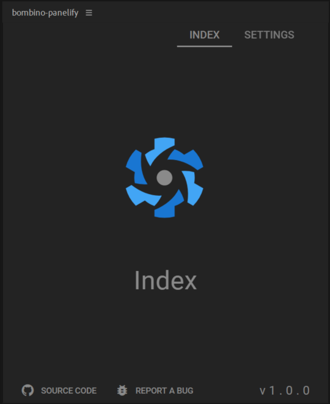

# bombino-quasar-panelify

## Template used in [bombino](https://github.com/Inventsable/bombino)



> **NOTE:** This repo should not be `git clone`d directly because it has breaking placeholder values and will not run on it's own.

```bash
# Node and bombino are required
npm install -g bombino

# In any valid CEP extension folder:
# (e.g. <USERNAME>/AppData/Roaming/CEP/extensions)
bombino
```

## No setup required for:

- [Vue](https://vuejs.org/) as JS framework
- Hot Reloading (panel updates instantly on every save during `npm run serve`)
- [Quasar](https://quasar.dev/) as CSS framework
- [Quasar-CLI](https://quasar.dev/) as Node.js tooling (webkit)
- Paginations via [Vue Router](https://router.vuejs.org/)
- State management with [Vuex](https://vuex.vuejs.org/)
- Support for additional ModalDialog extension sharing same app root as panel
- Full typescript support for any app with pravdomil's Adobe types (same as writing .jsx scripts but access to host DOM as autocomplete while typing)
- Full [Material Design Icon](https://materialdesignicons.com/) support
- Various personal utility components that handle context/flyout menus, launching CEF debug, common errors with Webpack, matching all host app styles and more
- ✨ [All color themes of any host app automatically handled by starlette library](https://github.com/Inventsable/starlette) ✨
- [CEP identification utilities provided by CEP-spy](https://github.com/Inventsable/CEP-Spy)
- [CEP function utilities provided by Cluecumber](https://github.com/Inventsable/Cluecumber)
- [Ability to be hosted online via panelify](https://github.com/Inventsable/panelify)

---

## Commands

This panel comes with commands baked in ([see details here](https://github.com/Inventsable/CEP-Self-Signing-Panel#what-do-they-do)):

- `npm run help` - A full list of the commands available and descriptions.
- `npm run switch` - Reports whether in developer or production context and can switch automatically.
- `npm run update` - Reports current version of panel in manifest and prompts to update Major, Minor, or Micro.
- `npm run register` - Reports the current user data (if any) and prompts to save new info to be used in certificates.
- `npm run sign` - Automatically stages and signs the extension, placing it in a `./archive` directory within the current panel.
- `npm run convert` _(PANELIFY ONLY)_ - Switches between Browser and Adobe context, handling the changes that must be made to `quasar.config.js` to function properly within each, allowing you to develop a panel's UI entirely in browser or deploy to a standalone site to later use within panelify.

---

## Getting Started

This template requires a bit more setup than other bombino templates.

- 1. You'll need to correct any information located in it's `./package.json`
- 2. You should launch it in an Adobe application first
- 3. Right click on the panel and choose `Generate fakeSpy` from the context menu

This will generate a static version of CEP-Spy using the information provided by the panel, which will later be used in any browser/panelify version of the panel.

---

## Panelify usage and Netlify continuous deployment

You can set up Netlify to create the production build of your panel every time a commit is pushed to your GitHub repository, creating a real-time, browser version of your panel.

- 1. Create a GitHub/GitLab/BitBucket repo for your panel (can be private)
- 2. Create a Netlify account and authorize it within your repo provider
- 3. Click the "New site from Git" in Netlify's home screen
- 4. Choose "Continuous Deployment" with your repo provider
- 5. Select the repo, or choose "Can't see your repo here? Configure the Netlify app" to add a particular repo to the list.

In `Site Settings` for `Build & deploy`:

- `Build command` - `quasar build`
- `Publish directory` - `dist/spa/`

This is all you need for the most basic setup, but you can choose branches or deployment options from here. Now every time you commit and push to your repo, Netlify will automatically rebuild it and display the production (even if in `Developer` context within bombino).

## Usage in Panelify

Panelify wraps an `iframe` within a mock window to give the illusion of an Adobe app. Within a Vue component, where `src` is the URL to your Netlify deployment:

```html
<template>
  <panelify
    extName="camAssist"
    appName="AEFT"
    src="https://camera-manager-panel.web.app/#/"
    width="450px"
    height="300px"
    :gradient="0"
  />
</template>

<script>
  // Must explicitly import the panelify component if not making it a global component:
  import { panelify } from "panelify";

  export default {
    name: "SomeComponent",
    components: {
      panelify,
      // Alternatively, with no need to import above:
      panelify: require("panelify").default
    }
  };
</script>
```

## Handling styling in Panelify

Starlette comes with the ability to manually initialize, notice that in `App.vue` at Line 62, you can manually set the default app and user theme whenever the browser context is detected.
